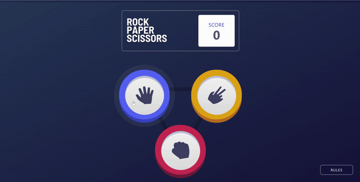

Rock-Paper-Scissors-Lizard-Spock Game
An interactive web application that brings the classic "Rock-Paper-Scissors-Lizard-Spock" game to life, featuring both frontend and backend components.

**🛠️ Tech Stack**
-Frontend: React, Tailwind CSS, Vite
-Backend: Node.js, Express
-Build Tools: Vite, ESLint

---

**🚀 Features**
-Engaging user interface with responsive design
-Real-time game logic processing
-Score tracking and game history
-RESTful API integration for game data management

---

**📸 Demo**
To provide a visual demonstration of your project:



---

**🧰 Installation**
Prerequisites
- Node.js (v14 or above)
- npm or yarn

Setup Instructions
Clone the repository:
```
git clone https://github.com/adarsh0930/rock-paper-scissor-lizard-spock-game.git
cd rock-paper-scissor-lizard-spock-game
```
Install dependencies:
```
npm install
```
Start the development server:
```
npm run dev
The application will be accessible at http://localhost:3000.
```

---

**🧪 Usage**
Interact with the application by selecting your choice among Rock, Paper, Scissors, Lizard, or Spock. The game will process the outcome and update the scores accordingly.

---

**🤝 Contributing**
-Contributions are welcome! Please follow these steps:
-Fork the repository
-Create a new branch: git checkout -b feature/YourFeature
-Commit your changes: git commit -m 'Add your feature'
-Push to the branch: git push origin feature/YourFeature
-Open a pull request

---
